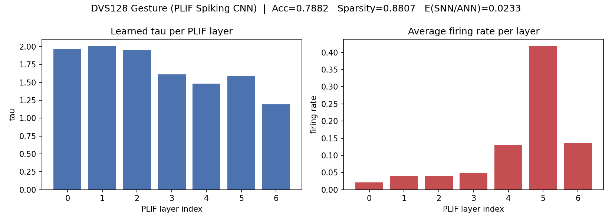

<<<<<<< HEAD
# 基于 PLIF 脉冲神经网络的事件相机手势识别

> 机器视觉课程作业「视觉算法应用」。用事件相机数据集 **DVS128 Gesture**，设计并训练一个
> 基于 **PLIF（可学习时间常数）脉冲神经元**的脉冲卷积网络（Spiking CNN），完成 11 类手势
> 识别，并定量分析其**稀疏性**与**能耗优势**。

| 指标 | 结果 |
|------|------|
| 数据集 | DVS128 Gesture（11 类手势，128×128） |
| 测试准确率 | **78.82%**（227/288 量级，11 分类） |
| 整体稀疏度 | **88.07%**（平均发放率 0.1193） |
| 能耗比 SNN/ANN | **0.0233**（约为同规模 ANN 的 1/43） |



---

## 1. 背景与动机

事件相机（event camera / DVS）输出的不是普通图像帧，而是**异步事件流** `(x, y, t, p)`：
某像素亮度变化时才在精确时刻产生一个事件。它具有高时间分辨率、高动态范围、低冗余的特点。

脉冲神经网络（SNN）的神经元同样以**离散脉冲 + 时间积分**的方式工作，天然契合事件数据的
稀疏、时序特性，且在神经形态硬件上能以极低功耗运行。因此「事件相机 + SNN」是处理手势这类
**随时间展开的动作**的理想组合 —— 这也是本作业的核心动机。

## 2. 数据集

**DVS128 Gesture**（IBM）：用 DVS128 相机录制的 11 类手势，来自 29 位受试者、3 种光照。
官方划分为 1176 个训练样本 / 288 个测试样本（按受试者划分，训练与测试为不同人）。

事件→帧表示：把每段事件流沿时间切成 `T=16` 个时间片，每片按极性累积成 2 通道帧，
得到张量 `[T, 2, 128, 128]`，`T` 即 SNN 的仿真时间步数。

## 3. 算法架构

```
输入 [T, 2, 128, 128]
  → 5 × [Conv3×3 - BN - PLIF - MaxPool2×2]      特征图: 128→64→32→16→8→4
  → Flatten → Dropout → FC → PLIF → Dropout → FC → PLIF
  → 输出每步脉冲 [T, 11] → 对时间维取平均(发放率) → 11 类分类
```

- **神经元**：PLIF（Parametric LIF），膜时间常数 `tau` 为**可学习参数**。
- **替代梯度**：发放函数不可导，反向传播用 ATan 替代梯度（surrogate gradient）近似。
- **训练**：时空反向传播（BPTT）+ Adam + 余弦退火 + 混合精度（AMP）。

## 4. 算法步骤

1. **事件编码**：异步事件 → `[T,2,128,128]` 帧（按事件数均分时间片）。
2. **前向（多步模式）**：输入沿 T 步推进，各 PLIF 神经元逐步积分膜电位、过阈值发放脉冲。
3. **读出**：对输出层 T 步脉冲取平均得发放率，作为各类得分。
4. **损失与反传**：交叉熵损失；BPTT 沿时间+层回传，发放处用替代梯度。
5. **复位**：每个 batch 后复位所有神经元膜电位，防止状态跨样本泄漏。

## 5. 创新点

1. **PLIF 可学习时间常数**：各层 `tau` 自适应学习。实验中 `tau` 随网络加深**单调减小**
   （2.0 → 1.19），说明浅层倾向「长时记忆、积累慢变化」，深层「快速响应」——
   这是固定 LIF 无法体现的，验证了可学习时间常数的价值。
2. **稀疏性 / 能耗定量分析**：统计各层发放率，整体稀疏度 88.07%；按 45nm CMOS 简化能耗
   模型（MAC≈4.6pJ、AC≈0.9pJ）估算，SNN 每连接每步能耗约为同规模 ANN 的 **1/43**，
   定量印证「事件相机 + SNN」的低功耗优势。

## 6. 实验结果与分析

- **准确率**：测试集 78.82%（11 分类，受试者无重叠划分）。
- **tau 分布**（见左图）：1.97 / 2.01 / 1.95 / 1.61 / 1.48 / 1.59 / 1.19，深层更小。
- **发放率**（见右图）：卷积层 2%~5% 高度稀疏，FC 层（PLIF_5）最高约 41.8%，
  整体平均 11.93% → 稀疏度 88.07%。
- **能耗比**：≈ 0.0233（越小越省电）。

> 说明：受单卡 8GB 显存与训练时长限制，本结果取 channels=64、epochs=64 的配置；
> 增大通道数与训练轮数可进一步提升准确率（架构与超参均已在代码中开放）。

## 7. 复现方式

环境与运行的完整步骤见 [`event_snn/README.md`](event_snn/README.md)。要点：

```bash
# RTX 50 系显卡需 CUDA 12.8 版 PyTorch
pip install torch torchvision --index-url https://download.pytorch.org/whl/cu128
pip install -r event_snn/requirements.txt

# 训练（数据集需手动下载，见 event_snn/README.md）
python event_snn/train.py --data-root <数据根目录> --amp

# 分析（输出 tau / 发放率 / 稀疏度 / 能耗，生成结果图）
python event_snn/analyze.py --data-root <数据根目录> --ckpt ./checkpoints/best.pth
```

## 8. 文件结构

```
.
├── event_snn/
│   ├── data.py            # 事件→帧 数据加载
│   ├── model.py           # PLIF 脉冲卷积网络
│   ├── train.py           # 训练（替代梯度 + BPTT + AMP）
│   ├── analyze.py         # 稀疏度/能耗/tau 分析
│   ├── plot_results.py    # 由实测数值重绘结果图
│   ├── requirements.txt   # 依赖
│   └── README.md          # 环境/运行/数据集下载详细说明
├── analysis_c64.png       # 结果图（tau 分布 + 各层发放率）
└── README.md              # 本文件（算法描述 + 结果报告）
```

> 数据集（2.8GB）与训练模型权重不纳入仓库，下载方式见 `event_snn/README.md`。
=======
# event-camera-snn-gesture
>>>>>>> 9ea85c7ceff42f2fce07e125dae554ecbd18d92a
